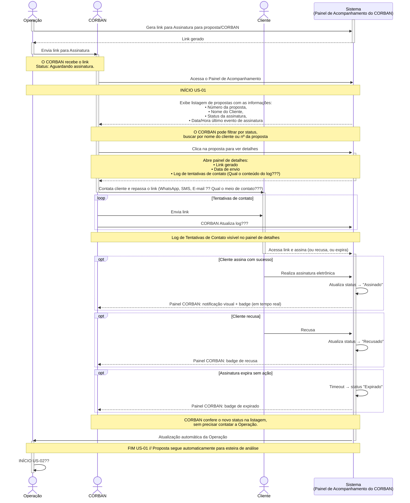
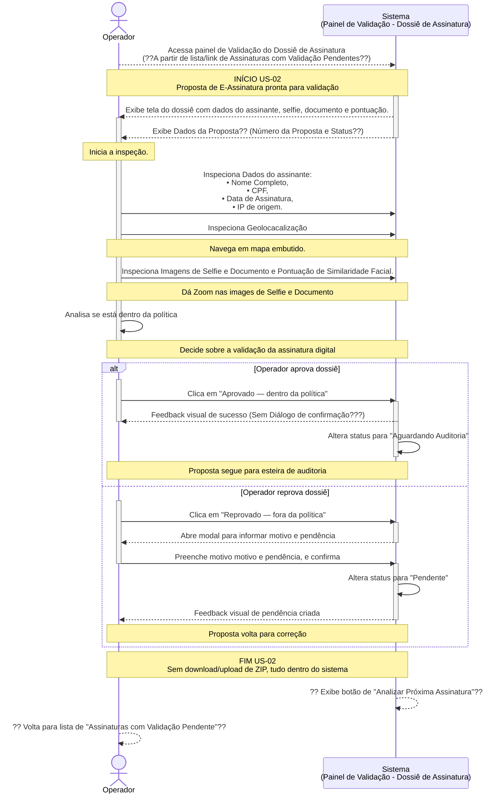
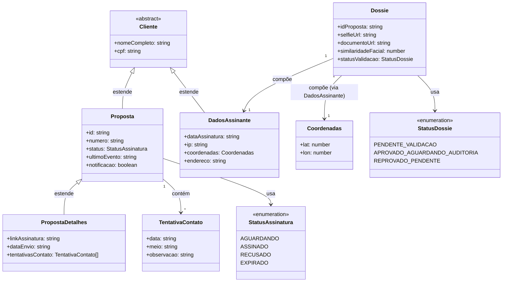
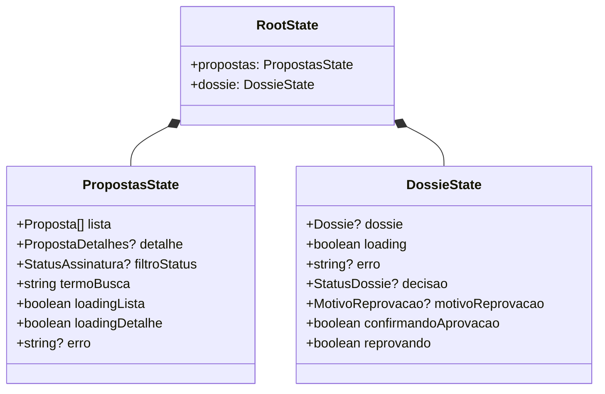

# Neo Crédito — Teste Técnico Front End

Projeto desenvolvido como parte do processo seletivo para a vaga de Desenvolvedor Front End, focado no módulo de Assinatura Eletrônica do portal interno de operações.

> [!IMPORTANT]
> <h3> Registro do Processo, Escolhas e Decisões de Projeto de Desenvolvimento</h3>
>
>Todas as escolhas de arquitetura, bibliotecas e padrões, assim como o registro do progresso de cada commit serão documentadas no arquivo [**DEV_CHOICES.md**](https://github.com/j-fborges/neocredito/blob/main/DEV_CHOICES.md).
>Lá você encontra justificativas completas alinhadas aos critérios de avaliação.
>
> **ATENÇÃO: A MOCKAGEM DA API SÓ FUNCIONA EM AMBIENTE DE DESENVOLVIMENTO**
>

## 1. Contexto do desafio

Implementar duas user stories em uma única aplicação coesa:
- US-01: Painel de Acompanhamento do CORBAN
- US-02: Validação do Dossiê de Assinatura

### 1.1. Diagramas de relações entre Atores, Ações e Eventos das User Stories

### 1.1.1. US-01: Painel de Acompanhamento do CORBAN

Diagrama de relações entre Atores, Ações e Eventos e Painel de Acompanhamento do CORBAN:

### 1.1.2. US-02: Painel de Validação do Dossiê de Assinatura

Diagrama de relações entre Atores, Ações e Eventos e Painel de Validação do Dossiê de Assinatura:

### 1.2. Diagramas de Modelagem de entidades e estados Client(para tipagem)

### 1.2.1. Diagrama de Modelagem de entidades

### 1.2.2. Diagrama para estados Client - Redux Store e Slices

## Stack
- Vite
- React
- TypeScript
- Tailwind CSS
- Redux Toolkit
- MSW
- React Router
