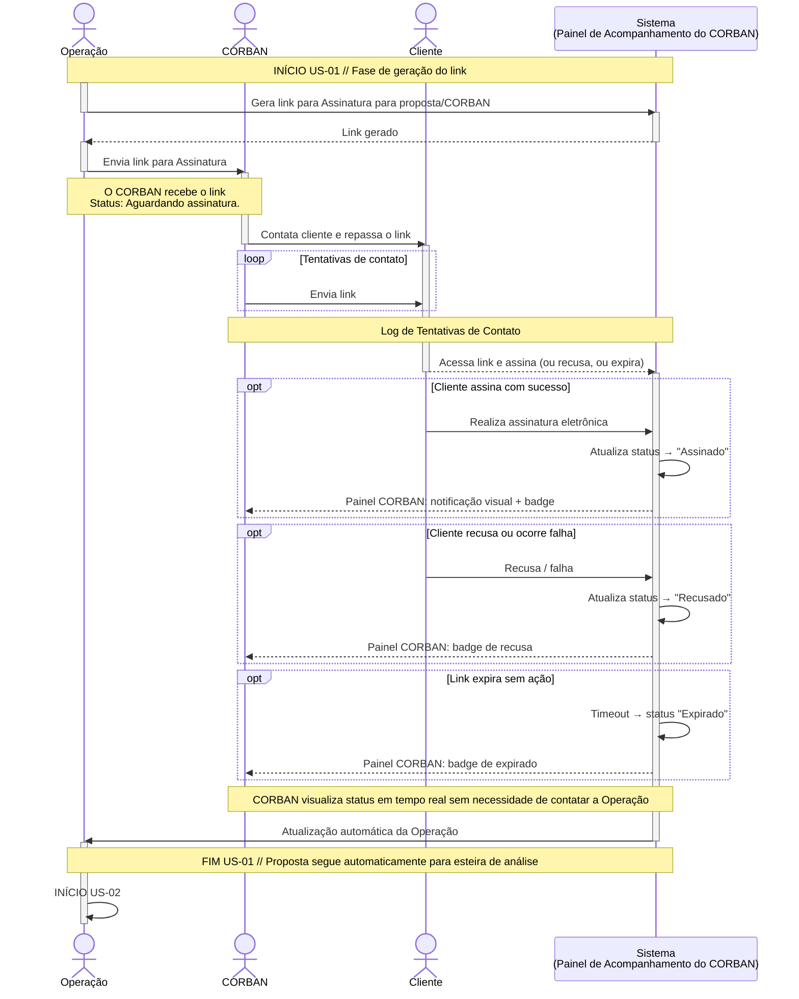

# Neo Crédito — Teste Técnico Front End

Projeto desenvolvido como parte do processo seletivo para a vaga de Desenvolvedor Front End, focado no módulo de Assinatura Eletrônica do portal interno de operações.

> [!IMPORTANT]
> <h3> Registro do Processo, Escolhas e Decisões de Projeto de Desenvolvimento</h3>
>
>Todas as escolhas de arquitetura, bibliotecas e padrões, assim como o registro do progresso de cada commit serão documentadas no arquivo [**DEV_CHOICES.md**](https://github.com/j-fborges/neocredito/blob/main/DEV_CHOICES.md).
>Lá você encontra justificativas completas alinhadas aos critérios de avaliação.
>
> **ATENÇÃO: A MOCKAGEM DA API SÓ FUNCIONA EM AMBIENTE DE DESENVOLVIMENTO**
>

## Contexto do desafio
Implementar duas user stories em uma única aplicação coesa:
- US-01: Painel de Acompanhamento do CORBAN
- US-02: Validação do Dossiê de Assinatura

### US-01: Painel de Acompanhamento do CORBAN

Diagrama de relações entre Atores, ações e Painel de Acompanhamento do CORBAN:

## Stack
- Vite
- React
- TypeScript
- Tailwind CSS
- Redux Toolkit
- MSW
- React Router
