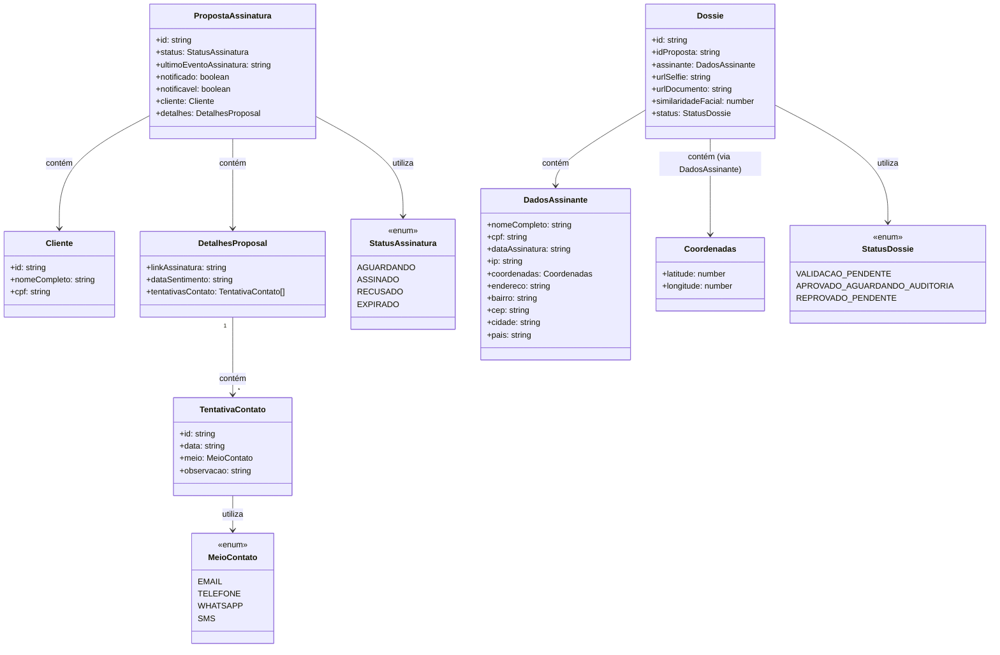

# Diagrama para Tipagem de Objetos - Conceitual

Não é necessariamente o que está implementado.* Aqui o pensamento é o de modelagens de entidades para além de instancias do frontend.

## Descrição dos Tipos

### Cliente
Dados básicos do cliente

### PropostaAssinatura
Proposta de assinatura eletrônica com status de processamento

### DetalhesProposal
Informações adicionais sobre a proposta de assinatura

### TentativaContato
Registro de tentativas de contato com o cliente

### DadosAssinante
Dados detalhados de quem assinou, incluindo localização

### Dossie
Dossiê completo de assinatura com validação
