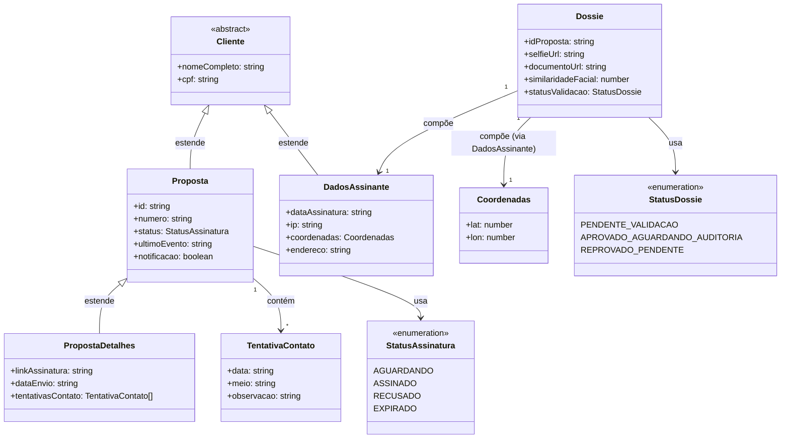

```mermaid

classDiagram
    class Cliente {
        <<abstract>>
        +nomeCompleto: string
        +cpf: string
    }

    class Proposta {
        +id: string
        +numero: string
        +status: StatusAssinatura
        +ultimoEvento: string
        +notificacao: boolean
    }

    class PropostaDetalhes {
        +linkAssinatura: string
        +dataEnvio: string
        +tentativasContato: TentativaContato[]
    }

    class DadosAssinante {
        +dataAssinatura: string
        +ip: string
        +coordenadas: Coordenadas
        +endereco: string
    }

    class Dossie {
        +idProposta: string
        +selfieUrl: string
        +documentoUrl: string
        +similaridadeFacial: number
        +statusValidacao: StatusDossie
    }

    class Coordenadas {
        +lat: number
        +lon: number
    }

    class TentativaContato {
        +data: string
        +meio: string
        +observacao: string
    }

    class StatusAssinatura {
        <<enumeration>>
        AGUARDANDO
        ASSINADO
        RECUSADO
        EXPIRADO
    }

    class StatusDossie {
        <<enumeration>>
        PENDENTE_VALIDACAO
        APROVADO_AGUARDANDO_AUDITORIA
        REPROVADO_PENDENTE
    }

    Cliente <|-- Proposta : estende
    Cliente <|-- DadosAssinante : estende
    Proposta <|-- PropostaDetalhes : estende
    Proposta "1" --> "*" TentativaContato : contém
    Dossie "1" --> "1" DadosAssinante : compõe
    Dossie "1" --> "1" Coordenadas : compõe (via DadosAssinante)
    Proposta --> StatusAssinatura : usa
    Dossie --> StatusDossie : usa

```