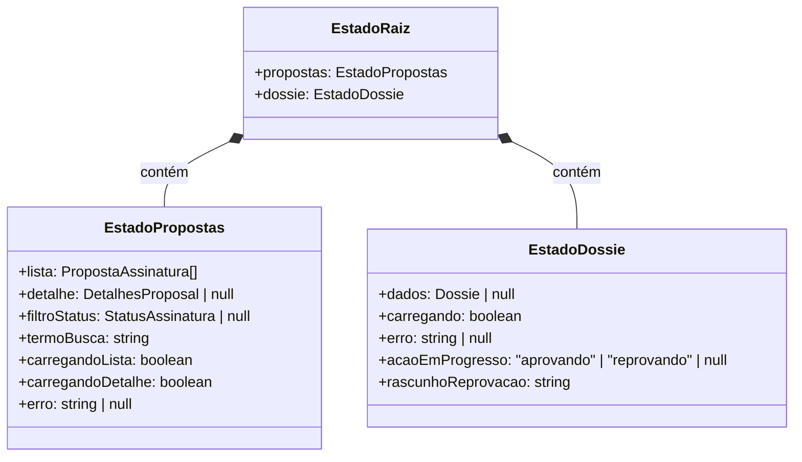

# Diagrama de Tipagem de Estados - Redux Store

Estrutura do estado global gerenciado pelo Redux Toolkit.

## Descrição dos Estados

### EstadoRaiz
Raiz da store Redux contendo todos os slices principais

### EstadoPropostas
Estado gerenciando a lista de propostas de assinatura e seus detalhes
- **lista**: Array de propostas
- **detalhe**: Detalhes de uma proposta específica
- **filtroStatus**: Filtro por status atual
- **termoBusca**: Termo de busca aplicado
- **carregandoLista**: Indicador de carregamento da lista
- **carregandoDetalhe**: Indicador de carregamento de detalhes
- **erro**: Mensagem de erro se houver

### EstadoDossie
Estado gerenciando o dossiê de assinatura e processo de validação
- **dados**: Dados do dossiê carregado
- **carregando**: Indicador de carregamento
- **erro**: Mensagem de erro se houver
- **acaoEmProgresso**: Ação sendo executada (aprovação ou reprovação)
- **rascunhoReprovacao**: Motivo de reprovação em edição
