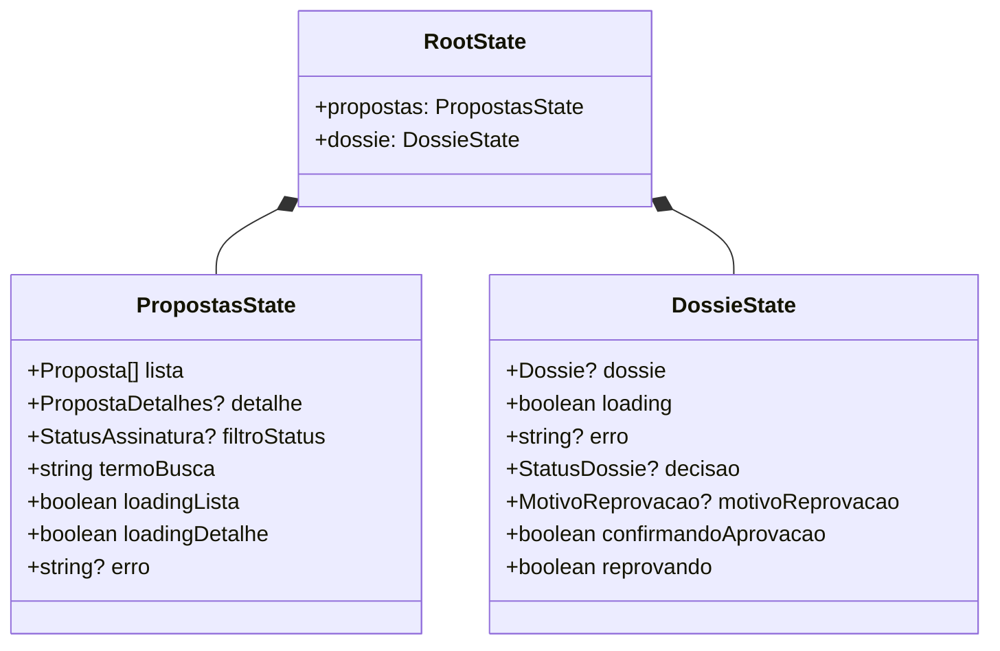

```mermaid

classDiagram
    class RootState {
        +propostas: PropostasState
        +dossie: DossieState
    }

    class PropostasState {
        +Proposta[] lista
        +PropostaDetalhes? detalhe
        +StatusAssinatura? filtroStatus
        +string termoBusca
        +boolean loadingLista
        +boolean loadingDetalhe
        +string? erro
    }

    class DossieState {
        +Dossie? dossie
        +boolean loading
        +string? erro
        +StatusDossie? decisao
        +MotivoReprovacao? motivoReprovacao
        +boolean confirmandoAprovacao
        +boolean reprovando
    }

    RootState *-- PropostasState
    RootState *-- DossieState

```