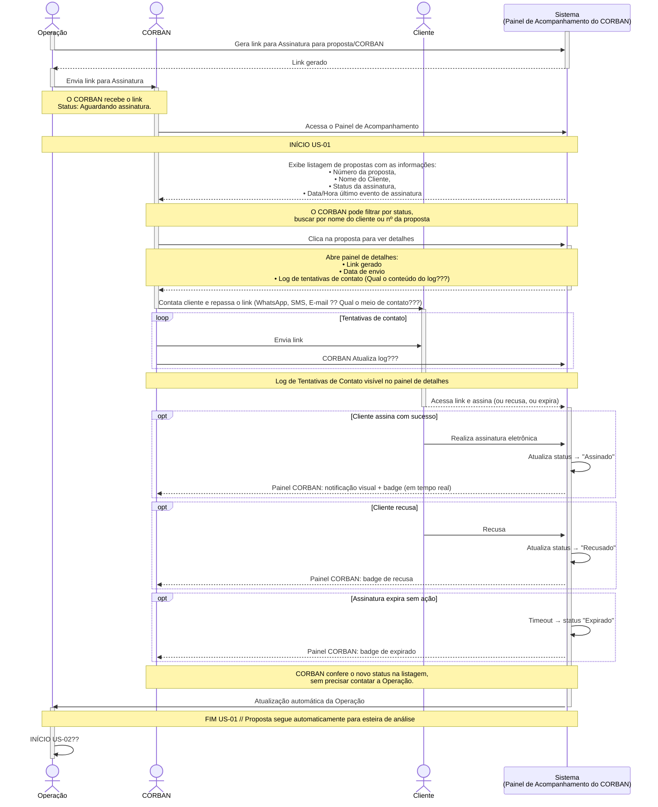

```mermaid
sequenceDiagram
    actor O as Operação
    actor C as CORBAN
    actor Cl as Cliente
    participant S as Sistema<br>(Painel de Acompanhamento do CORBAN)

    activate S
    activate O
    O->>S: Gera link para Assinatura para proposta/CORBAN #123
    deactivate O
    S-->>O: Link gerado
    deactivate S
    activate O

    O->>C: Envia link para Assinatura
    deactivate O
    activate C
    Note over O, C: O CORBAN recebe o link<br>Status: Aguardando assinatura.

    C->>S: Acessa o Painel de Acompanhamento
    Note over O, S: INÍCIO US-01
    activate S
    S-->>C: Exibe listagem de propostas com as informações:<br>• Número da proposta,<br>• Nome do Cliente,<br>• Status da assinatura,<br>• Data/Hora último evento de assinatura

    Note over C, S: O CORBAN pode filtrar por status,<br>buscar por nome do cliente ou nº da proposta

    C->>S: Clica na proposta para ver detalhes
    activate S
    Note over S,C: Abre painel de detalhes:<br>• Link gerado<br>• Data de envio<br>• Log de tentativas de contato (Qual o conteúdo do log???)
    S-->>C:
    deactivate S

    C->>Cl: Contata cliente e repassa o link (WhatsApp, SMS, E-mail ?? Qual o meio de contato???)
    deactivate C
    activate Cl
    loop Tentativas de contato
        C->>Cl: Envia link
        C->>S: CORBAN Atualiza log???
    end
    Note over C, S: Log de Tentativas de Contato visível no painel de detalhes

    Cl-->>S: Acessa link e assina (ou recusa, ou expira)
    deactivate Cl

    activate S
    opt Cliente assina com sucesso
        Cl->>S: Realiza assinatura eletrônica
        S->>S: Atualiza status → "Assinado"
        S-->>C: Painel CORBAN: notificação visual + badge (em tempo real)
    end

    opt Cliente recusa
        Cl->>S: Recusa
        S->>S: Atualiza status → "Recusado"
        S-->>C: Painel CORBAN: badge de recusa
    end

    opt Assinatura expira sem ação
        S->>S: Timeout → status "Expirado"
        S-->>C: Painel CORBAN: badge de expirado
    end

    Note over C, S: CORBAN confere o novo status na listagem,<br>sem precisar contatar a Operação.

    S->>O: Atualização automática da Operação
    deactivate S
    activate O
    Note over S, O: FIM US-01 // Proposta segue automaticamente para esteira de análise

    O->>O: INÍCIO US-02??
    deactivate O
```