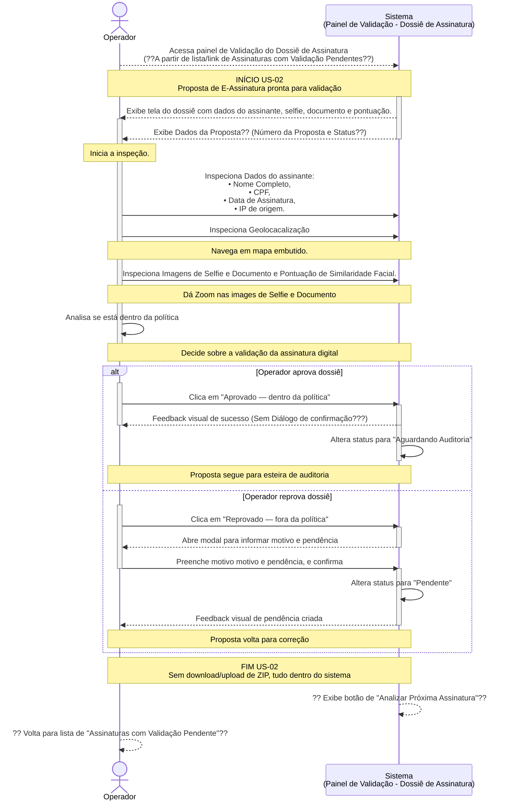

```mermaid

sequenceDiagram
    actor O as Operador
    participant S as Sistema<br>(Painel de Validação - Dossiê de Assinatura)

    O-->>S: Acessa painel de Validação do Dossiê de Assinatura<br>(??A partir de lista/link de Assinaturas com Validação Pendentes??)

    Note over O, S: INÍCIO US-02<br/>Proposta de E-Assinatura pronta para validação

    activate S
    S-->>O: Exibe tela do dossiê com dados do assinante, selfie, documento e pontuação.
    activate O
    S-->>O: Exibe Dados da Proposta?? (Número da Proposta e Status??)
    deactivate S

    Note over O: Inicia a inspeção.
    O->>S: Inspeciona Dados do assinante:<br>• Nome Completo,<br>• CPF,<br>• Data de Assinatura,<br>• IP de origem.
    O->>S: Inspeciona Geolocacalização
    Note over O,S: Navega em mapa embutido.

    O->>S: Inspeciona Imagens de Selfie e Documento e Pontuação de Similaridade Facial.
    Note over O,S: Dá Zoom nas images de Selfie e Documento

    O->>O: Analisa se está dentro da política

    Note over O,S: Decide sobre a validação da assinatura digital
    deactivate O

    alt Operador aprova dossiê
        activate O
        O->>S: Clica em "Aprovado — dentro da política"
        activate S
        S-->>O: Feedback visual de sucesso (Sem Diálogo de confirmação???)
        deactivate S
        deactivate O
        activate S
        S->>S: Altera status para "Aguardando Auditoria"
        deactivate S
        Note over O, S: Proposta segue para esteira de auditoria
    else Operador reprova dossiê
        activate O
        O->>S: Clica em "Reprovado — fora da política"
        activate S
        S-->>O: Abre modal para informar motivo e pendência
        deactivate S
        O->>S: Preenche motivo motivo e pendência,  e confirma
        deactivate O
        activate S
        S->>S: Altera status para "Pendente"
        S-->>O: Feedback visual de pendência criada
        deactivate S
        Note over O, S: Proposta volta para correção
    end

    Note over O, S: FIM US-02<br/>Sem download/upload de ZIP, tudo dentro do sistema
        S-->>S: ?? Exibe botão de "Analizar Próxima Assinatura"??
        O-->>O: ?? Volta para lista de "Assinaturas com Validação Pendente"??

```